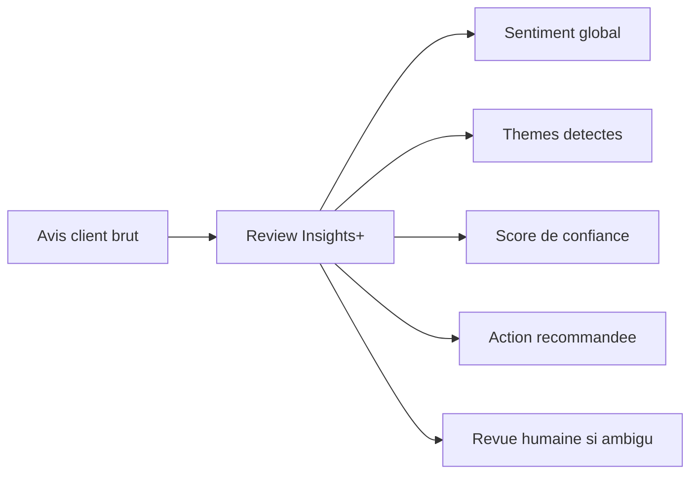
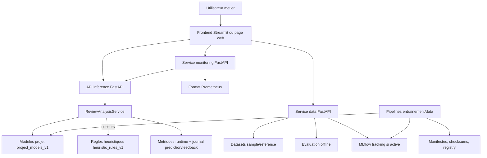
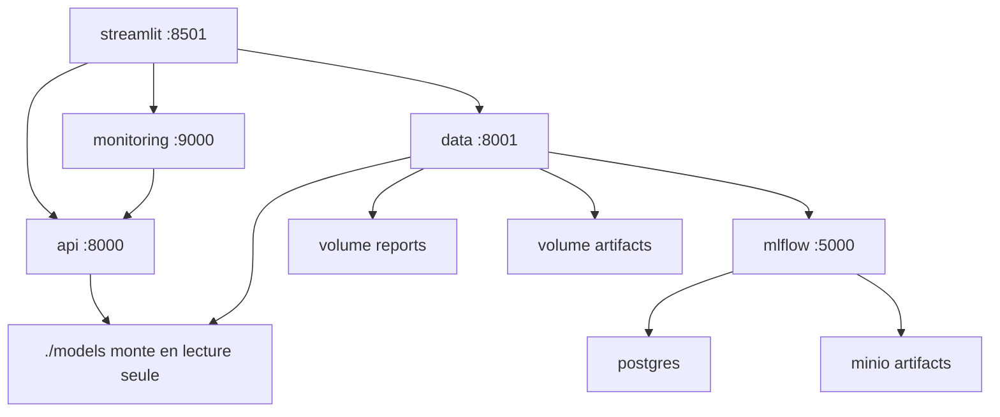
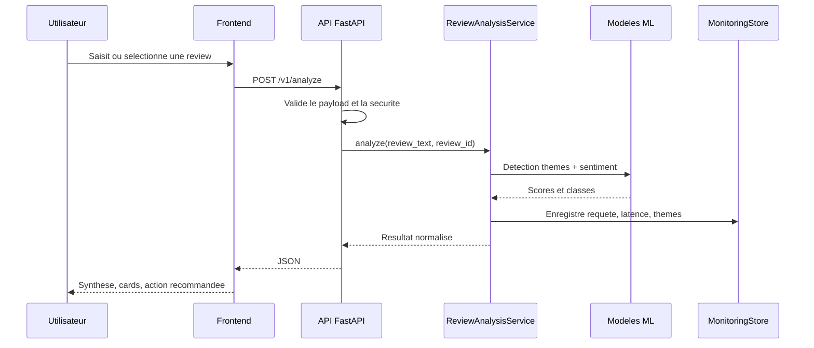
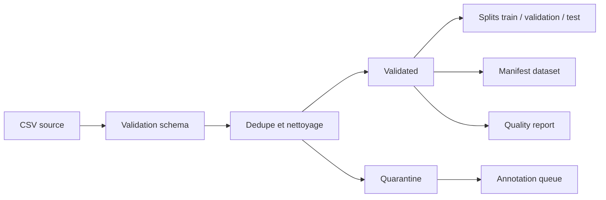
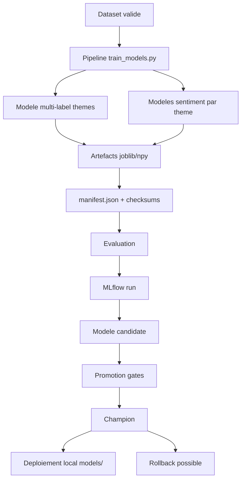
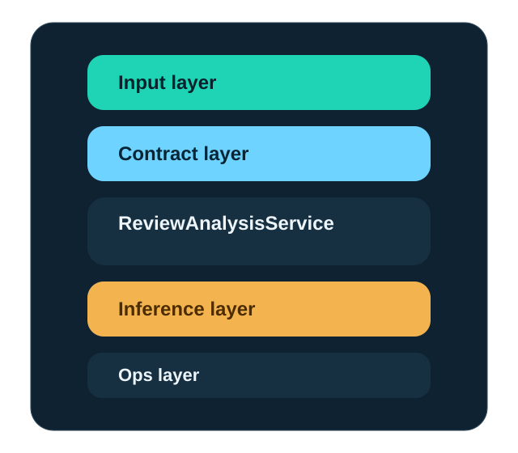
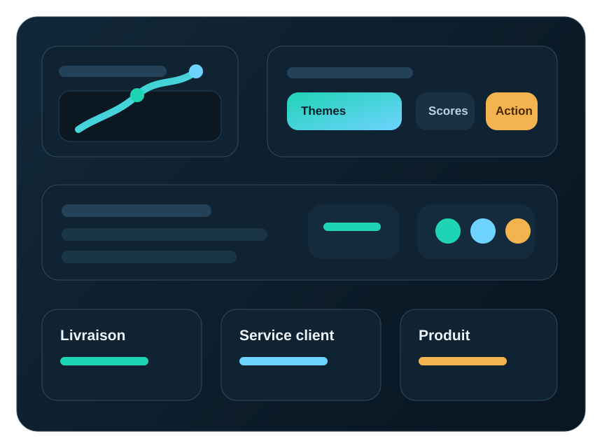
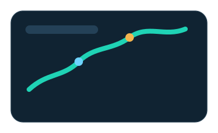

# Etat des lieux pedagogique du POC Review Insights+

Date de verification locale: 2026-07-01

Ce document explique le POC de facon simple: ce qu'il fait, comment il est organise, ce qui est deja solide, et ce qui reste a renforcer avant une vraie mise en production.

## Resume executif

Review Insights+ est un POC/MVP MLOps qui analyse des avis clients en anglais.

Il transforme un commentaire brut en informations exploitables:

- sentiment global: positif, negatif ou neutre;
- themes detectes: livraison, service client, produit;
- sentiment par theme;
- score de confiance;
- indices/evidences;
- recommandation d'action;
- drapeau `needs_human_review` quand le cas est ambigu.

Etat actuel:

| Domaine | Etat | Lecture simple |
| --- | --- | --- |
| Inference API | OK | L'API FastAPI fonctionne et charge les modeles locaux. |
| Modeles ML | OK pour POC | Les artefacts sont presents, verifies par checksum, et utilises par defaut. |
| Frontend | OK pour demo | Streamlit local + page web statique connectable a une API publique. |
| Tests | OK | 106 tests passent et 4 tests Dagster sont ignores uniquement dans le Python hote sans dependances Dagster. |
| Data pipeline | Bon socle | Ingestion, validation, quarantaine, splits, manifestes et quality gates existent. |
| MLOps | Bon socle | MLflow, model registry, gates minimum/maximum, promotion et rollback sont prepares. |
| Orchestration | OK | Dagster expose les assets, jobs, schedules, sensors et quality checks. |
| Monitoring | OK pour MVP | Prometheus, Pushgateway, Blackbox, cAdvisor, Alertmanager et Grafana sont provisionnes. |
| Production | À valider | Le socle est industrialisable; dataset réel, secrets et receivers d'alerte restent à configurer. |

Verification runtime:

- backend charge: `project_models_v1`;
- version d'artefacts: `0.1.0`;
- source modele: locale;
- erreur de chargement modele: aucune;
- evaluation de reference: 40 lignes;
- `sentiment_accuracy`: 0.575;
- `sentiment_macro_f1`: 0.5111;
- `theme_exact_match`: 0.675;
- `theme_precision_macro`: 0.8787;
- `theme_recall_macro`: 0.8972;
- `theme_f1_macro`: 0.8877;
- `human_review_rate`: 0.5.

Interpretation tres simple: le POC est coherent et demontrable, mais le modele n'est pas encore au niveau production. Il est surtout fort sur l'architecture MLOps, la demonstration produit et la gouvernance technique.

## Vision pedagogique

Image mentale:



Exemple:

Entree:

```text
customer support never answered and the refund process was slow
```

Sortie simplifiee:

| Champ | Valeur |
| --- | --- |
| Sentiment global | negative |
| Theme detecte | sav |
| Sentiment theme SAV | negative |
| Confiance | 0.68 |
| Revue humaine | non |
| Action | Escalader vers les operations support. |

## Architecture en une phrase

Le POC est compose d'une interface utilisateur, d'une API d'analyse, d'un service data, d'un service monitoring, de modeles ML, et d'une couche MLOps pour entrainer, suivre, promouvoir et redeployer les modeles.

## Architecture globale



## Architecture Docker locale



Lecture simple:

- `api` sert a analyser les avis;
- `data` sert a exposer/evaluer les datasets;
- `monitoring` sert a exposer les metriques de l'API;
- `streamlit` sert a utiliser le POC sans coder;
- `mlflow`, `postgres` et `minio` servent a tracer les entrainements et stocker les artefacts.

## Chemin d'une prediction



## Fonctionnalites principales

### 1. Analyse unitaire

Une review est envoyee a `/v1/analyze`.

Le systeme renvoie:

- `global_sentiment`;
- `score_global`;
- `themes_detected`;
- `needs_human_review`;
- `insights`;
- `theme_livraison`, `theme_sav`, `theme_produit`;
- `sent_livraison`, `sent_sav`, `sent_produit`;
- scores de confiance;
- evidences.

### 2. Analyse par lot

Le frontend Streamlit peut charger un CSV, analyser plusieurs lignes, puis exporter un CSV ou JSON enrichi.

La page statique `site/app-online.html` permet aussi une analyse batch cote navigateur, mais son parsing CSV reste simple.

### 3. Evaluation offline

L'evaluation de reference compare les predictions au dataset `data/sample/reviews_poc_test.csv`.

Metriques calculees:

- accuracy sentiment;
- exact match des themes;
- precision macro themes;
- recall macro themes.

### 4. Monitoring runtime

L'API garde en memoire:

- nombre total de requetes;
- nombre de cas envoyes en revue humaine;
- taux de revue humaine;
- latence moyenne, p50, p95;
- distribution des sentiments;
- distribution des themes;
- distribution des backends.

Le service monitoring expose ces informations en JSON et en format Prometheus.
L'API retourne aussi un `X-Request-ID` et suit les requetes HTTP par statut, endpoint, latence et
taux d'erreur.

### 5. Data governance

Le POC contient un contrat de donnees et une politique qualite.



Ce que cela apporte:

- on sait quelles colonnes sont attendues;
- les lignes invalides sont isolees;
- les datasets valides sont versionnes;
- les checksums permettent de prouver ce qui a ete utilise;
- les datasets trop faibles peuvent etre bloques par quality gates.

### 6. Entrainement et cycle MLOps



Le projet prevoit:

- entrainement de modeles scikit-learn;
- generation d'artefacts;
- manifestes avec checksums;
- logging MLflow;
- enregistrement d'un modele candidate;
- promotion en champion si les metriques passent;
- rollback vers l'ancien champion.

## Organisation du code

| Chemin | Role simple |
| --- | --- |
| `src/review_insights/api.py` | API principale d'inference. |
| `src/review_insights/service.py` | Orchestrateur metier central. |
| `src/review_insights/model_backend.py` | Chargement et inference des modeles ML. |
| `src/review_insights/engine.py` | Backend heuristique de secours. |
| `src/review_insights/app.py` | Frontend Streamlit. |
| `src/review_insights/data_api.py` | API data/evaluation. |
| `src/review_insights/monitoring_api.py` | API monitoring/Prometheus. |
| `src/review_insights/data_store.py` | Ingestion, validation, splits, manifestes. |
| `src/review_insights/data_quality.py` | Checks qualite data. |
| `src/review_insights/mlflow_tracking.py` | Tracking MLflow et logging modeles. |
| `src/review_insights/model_registry.py` | Promotion et rollback modele. |
| `pipelines/` | Scripts data, training, evaluation, promotion. |
| `models/` | Artefacts ML actifs. |
| `data/` | Sample, contrats, zones data. |
| `site/` | Landing page et console web statique. |
| `docker/` et `compose.yaml` | Execution microservices locale. |
| `docs/` | Documentation projet. |
| `tests/` | Tests unitaires/integration POC. |

## Images pedagogiques existantes

Le projet contient deja des visuels SVG reutilisables dans `site/assets/`:







Ces images sont utiles pour une soutenance ou une presentation courte.

## Points forts

1. Architecture claire et modulaire.

Le POC n'est pas un notebook isole. Il se presente comme un petit produit: API, UI, data service, monitoring, Docker, tests et documentation.

2. Backend ML charge en runtime.

Le service charge les artefacts locaux `project_models_v1`. Si cela echoue, un backend heuristique prend le relais.

3. Bons reflexes de gouvernance.

Contrats de donnees, quality gates, manifestes, checksums, DVC, MLflow et model registry sont presents.

4. Surface de demonstration complete.

On peut montrer une analyse unitaire, un batch, un dashboard, une evaluation offline, un healthcheck et des metriques.

5. Tests automatises.

La suite locale finale passe 106 tests avec 4 skips conditionnels lorsque Dagster n'est pas installe
dans le Python hote. Les definitions et les jobs Dagster sont valides et executes dans leur
conteneur de reference.

## Limites actuelles

1. Performance modele encore POC.

L'evaluation de reference donne `sentiment_accuracy = 0.575`, `sentiment_macro_f1 = 0.5111` et `theme_exact_match = 0.675`. C'est utile pour une demo, mais insuffisant pour une production.

2. Donnees limitees.

Le scope est volontairement limite aux reviews en anglais et aux trois themes livraison/SAV/produit.

3. Retention de monitoring limitee au POC.

Les evenements prediction/feedback et les resultats de drift sont persistants dans les volumes
locaux. Prometheus, Pushgateway, Alertmanager et Grafana sont operationnels. Une retention longue,
un stockage distant et une strategie multi-replicas restent necessaires en production.

4. Securite configurable mais pas durcie par defaut.

L'API key est optionnelle dans `.env.example`, les origins/trusted hosts sont ouverts par defaut, et les secrets Docker sont des placeholders.

5. MLflow depend du profil Compose complet.

Dans le profil `control`, MLflow, PostgreSQL et MinIO tracent les runs et stockent les artefacts.
Le lancement Python minimal hors Compose ne fournit volontairement pas cette persistance.

6. Frontend statique public limite.

La page web publique ne peut pas appeler une API protegee avec secret sans backend intermediaire. C'est normal, mais important a expliquer.

## Verdict

Le POC est en bon etat pour une demonstration technique et produit. Il montre un vrai raisonnement MLOps: donnees, modeles, API, monitoring, evaluation, versionnement et deploiement.

Il n'est pas encore pret comme service production, surtout a cause de la performance modele, de la taille/qualite des donnees, de la persistance monitoring et du durcissement securite.

La priorite de phase suivante devrait etre:

1. enrichir et qualifier le dataset;
2. ameliorer les modeles et leurs metriques;
3. activer MLflow/registry sur une instance partagee avec artefacts durables;
4. appliquer la configuration staging durcie: API key, CORS, hosts, docs fermees et secrets;
5. configurer retention, sauvegardes et receiver Alertmanager pour l'environnement cible;
6. recalibrer la politique de drift avec du trafic et du feedback reels.
