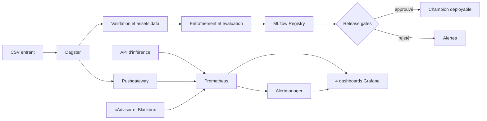

# Orchestration et centre de contrôle — version 1.0

## Objectif

La couche de contrôle automatise les workflows data et ML sans dupliquer leur logique métier.
Dagster appelle directement les fonctions existantes d'ingestion, validation, entraînement,
évaluation, tracking MLflow, promotion et rollback.

Elle est isolée dans le profil Docker Compose `control`. L'API et l'interface continuent donc de
fonctionner lorsque Dagster, Prometheus ou Grafana sont arrêtés.



## Démarrage

```powershell
docker compose --profile control up --build -d
```

Interfaces :

| Service | URL | Usage |
| --- | --- | --- |
| Application | `http://localhost:8501` | Analyse et correction humaine |
| Dagster | `http://localhost:3001` | Assets, jobs, schedules, sensors et lineage |
| Grafana | `http://localhost:3000` | Dashboards et alertes |
| MLflow | `http://localhost:5000` | Runs, artefacts et Model Registry |
| Prometheus | `http://localhost:9090` | Métriques et règles d'alerte |
| Pushgateway | `http://localhost:9091` | Métriques des jobs batch |
| Alertmanager | `http://localhost:9093` | Groupement, silences et routage des alertes |

Les identifiants Grafana initiaux proviennent de `GRAFANA_ADMIN_USER` et
`GRAFANA_ADMIN_PASSWORD`. Le mot de passe d'exemple doit être remplacé hors environnement local.

## Workflows Dagster

### `data_pipeline_job`

1. archive et versionne le CSV source ;
2. valide le contrat des données ;
3. écrit les datasets traité, validé et rejeté ;
4. crée les splits reproductibles ;
5. matérialise la file d'annotation ;
6. publie les métriques de qualité.

Le contrôle `dataset_quality_gates` reste visible même lorsqu'il échoue. Le pipeline data peut
ainsi produire les diagnostics et la quarantaine. L'entraînement, lui, refuse explicitement un
dataset qui n'a pas le statut `ready`.

### `model_training_job`

1. exécute le pipeline data ;
2. vérifie les quality gates ;
3. entraîne les modèles projet ;
4. évalue sur le split indépendant ;
5. journalise les métriques et artefacts dans MLflow ;
6. enregistre une version `candidate` ;
7. génère le rapport de release et applique les seuils de promotion.

Les splits déterministes utilisent 60 % des lignes pour l'entraînement, 15 % pour la validation
et 25 % pour le test indépendant. Ainsi, le minimum de 120 lignes du jeu de test opérationnel
fournit 30 observations d'évaluation et reste cohérent avec le gate de release `rows >= 30`.

Le service data monte le volume orchestré en lecture seule et expose automatiquement le dernier
dataset ayant le statut `ready` aux vues Streamlit. Les corrections humaines sont conservées dans
le volume Docker `feedback_data`, y compris après recréation du conteneur.

### `model_promotion_job`

La promotion est séparée de l'entraînement et fonctionne en `dry_run=true` par défaut. Cette
barrière évite qu'un simple schedule remplace automatiquement le champion. Après validation du
processus, lancer le job avec `dry_run=false` et, si nécessaire, renseigner `deploy_model_dir`.

## Automatisations

- `incoming_review_csv_sensor` surveille `data/raw/incoming/*.csv` toutes les 30 secondes ;
- `daily_full_pipeline_schedule` s'exécute chaque jour à 19:00 Europe/Paris, lit le CSV entrant le plus récent et lance ingestion, quality gates, entraînement, évaluation, enregistrement MLflow et rapport de release ;
- `pipeline_failure_alert` envoie un webhook si `ALERT_WEBHOOK_URL` est configuré.

Le schedule quotidien est activé par défaut. S'il ne trouve aucun CSV dans
`data/raw/incoming/`, le tick est marqué `SKIPPED` sans lancer de run. Le fichier doit respecter
les quality gates, notamment au moins 100 lignes valides et 10 exemples par classe et par thème.
Le SHA-256 du CSV le plus récent est comparé au registry : un fichier déjà ingéré est également
marqué `SKIPPED`, tandis qu'un fichier nouveau ou modifié déclenche le workflow complet.
La promotion du candidat reste volontairement séparée et n'est jamais automatique.

Pour déposer un dataset automatiquement :

```powershell
Copy-Item mon_dataset.csv data/raw/incoming/
```

Tester les définitions et l'ingestion sans attendre 19:00 :

```powershell
py -3 -m pytest tests/test_control_plane.py -vv
```

Pour tester immédiatement le workflow complet, ouvrir Dagster sur `http://localhost:3001`, choisir
`model_training_job`, ouvrir **Launchpad**, renseigner le chemin du CSV entrant dans la configuration
de `ingested_review_dataset`, puis cliquer sur **Launch Run**.

## Dashboards provisionnés

1. **API & Inférence** : disponibilité, débit, erreurs, latence, backend Transformer, revue humaine et contradictions.
2. **Données & Modèles** : qualité, volumes, fraîcheur, entraînement, métriques candidat et release gates.
3. **Système & Orchestration** : disponibilité des services, CPU, mémoire, Dagster, MLflow et alertes actives.
4. **Qualité Métier** : sentiments, thèmes, provenance, contradictions et backlog d'annotation.

Les dashboards sont versionnés dans `deploy/grafana/dashboards/`. Grafana les charge en lecture
seule au démarrage, ce qui permet de reproduire exactement le centre de contrôle.

## Alertes

Prometheus évalue les règles de `deploy/prometheus/rules/review-insights.yml` :

- API indisponible ;
- taux d'erreurs HTTP supérieur à 5 % ;
- revue humaine supérieure à 60 % ;
- contradictions de sentiment supérieures à 20 % ;
- dataset rejeté par les quality gates ;
- candidat rejeté par les release gates.

Les alertes sont envoyées à Alertmanager et visibles dans Grafana. Le receiver fourni conserve un
centre de contrôle local sans envoyer de message externe. Pour la production, compléter
`deploy/alertmanager/alertmanager.yml` avec le receiver de l'organisation (email, Slack, webhook ou
PagerDuty). Les échecs Dagster utilisent directement `ALERT_WEBHOOK_URL`.

## Responsabilités

- GitHub Actions valide le code, les définitions Dagster, Compose et les dashboards.
- Dagster orchestre et historise les workflows.
- MLflow reste la source de vérité des expériences et versions de modèles.
- Prometheus conserve les séries temporelles et évalue les alertes.
- Grafana présente les indicateurs de contrôle.
- Streamlit reste l'interface métier et ne devient pas une console MLOps.
