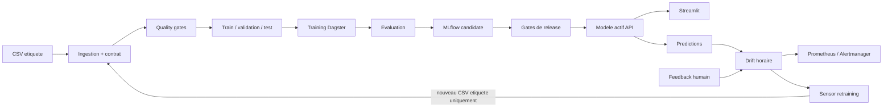

# Synthese technique finale - Review Insights+

Date de validation: 1er juillet 2026  
Perimetre: code, donnees, ML, orchestration, API, frontend, observabilite et logique metier.

## Verdict

La chaine POC/MVP est fonctionnelle de bout en bout: ingestion d'un CSV, controles qualite,
creation des splits, entrainement, evaluation, enregistrement MLflow, decision de release,
inference API, affichage Streamlit, journalisation prediction/feedback, monitoring de drift,
alertes Prometheus et visualisation Grafana.

Le verdict est **valide pour demonstration et validation POC/MVP**. Il ne signifie pas qu'un
deploiement public est automatiquement pret: les secrets, le receiver Alertmanager, la retention,
les sauvegardes et le dimensionnement doivent etre adaptes a l'environnement cible.

## Corrections finales appliquees

1. Le manifest dataset recupere maintenant le commit depuis `GIT_COMMIT_SHA`, `GITHUB_SHA` ou
   `SOURCE_VERSION` avant le fallback Git local. Le conteneur Dagster recoit `GIT_COMMIT_SHA`.
2. Le logging de metriques MLflow demande une ecriture synchrone lorsque la version du client le
   permet, avec fallback compatible.
3. Un test garantit la priorite de la revision de deploiement dans les manifests.
4. Les documents historiques sont marques comme tels et la documentation d'exploitation decrit
   desormais les dashboards, alertes et controles de drift reels.

## Matrice de validation

| Domaine | Controle | Resultat |
| --- | --- | --- |
| Qualite code | Ruff sur tout le depot | Passe |
| Tests Python | pytest | 106 passes, 4 skips conditionnels |
| Couverture | seuil 70 % | 78,32 % |
| Compose | resolution de la configuration normale et `control` | Valide |
| Dagster | validation des definitions dans le conteneur | Valide |
| Runtime | services Compose | 17 services actifs |
| Endpoints | API, data, monitoring, UI et outils | 9/9 en HTTP 200 |
| Smoke fonctionnel | script complet | 10/10 controles passes |
| Prometheus | targets | 13/13 UP |
| Dataset | ingestion du CSV test 120 lignes | 120 valides, 0 rejetee |
| Training | job Dagster reel | SUCCESS |
| Drift | job Dagster reel | SUCCESS |
| Promotion | controle de release | approved_dry_run |
| UI | Streamlit et dashboards | Affichage valide |

Les quatre skips locaux concernent uniquement l'absence de Dagster dans le Python hote. Ils sont
compenses par la validation des definitions et l'execution reelle des jobs dans le conteneur Dagster
de reference.

## Workflow metier valide



La logique metier importante est respectee:

- les nouveaux commentaires non etiquetes sont analyses et suivis, mais ne sont pas injectes
  automatiquement dans l'entrainement;
- le drift peut recommander un retraining;
- le sensor ne relance le training que si un nouveau CSV etiquete et non encore ingere est
  disponible;
- un candidat n'ecrase jamais automatiquement le champion: les gates et la promotion restent
  controles;
- le test de promotion a ete execute en `dry-run`, donc sans mutation non voulue du modele actif.

## Donnees et reproductibilite

Le CSV de validation contient 120 lignes equilibrees, soit 40 reviews par sentiment. L'ingestion a
produit:

- 120 lignes valides;
- 0 ligne rejetee;
- 0 ligne en file d'annotation;
- 72 lignes train, 18 validation et 30 test;
- checksum, manifest, rapport qualite et splits deterministes;
- commit source `51a98233f86c151008df3c2119e985d9599606eb` dans le manifest.

## Modele et registry

- backend actif de l'API: `project_models_v1`;
- evaluation de reference du modele actif: accuracy sentiment `0,575`, F1 themes `0,8877`;
- candidat du test controle: version MLflow `2`, alias `candidate`, etat `READY`;
- decision de promotion: `approved_dry_run`;
- aucun remplacement implicite du modele actif.

Les metriques parfaites visibles pour le candidat (`1,0`) proviennent du petit dataset synthetique
de validation. Elles prouvent le fonctionnement technique, pas une generalisation en production.
La metrique de reference sur 40 reviews reste la mesure honnete de la qualite actuelle.

## Drift, feedback et alertes

Le scenario de test a cree 30 evenements de prediction et 10 feedbacks volontairement incorrects.
Le monitoring a mesure:

| Metrique | Valeur |
| --- | ---: |
| Accuracy combinee feedback | 0,100 |
| Divergence JS sentiment | 0,060578 |
| Divergence JS themes | 0,013710 |
| Taux de revue humaine | 0,400 |
| Taux de contradiction sentiment | 0,200 |
| Recommandation retraining | oui |
| Trigger | `feedback_combined_accuracy` |

Prometheus a declenche `ReviewInsightsDriftDetected` et
`ReviewInsightsPerformanceDrift`. Ce sont des **alertes attendues du test**, pas une panne du
runtime. Elles prouvent que la degradation metier est detectee et transformee en recommandation.

## Automatisations Dagster

| Automatisation | Cadence/etat |
| --- | --- |
| `daily_full_pipeline_schedule` | tous les jours a 19:00, fuseau Europe/Paris |
| drift monitoring | toutes les heures, minute 15 |
| `drift_retraining_sensor` | actif |
| `pipeline_failure_alert` | actif |
| sensor CSV entrant | arrete volontairement pour eviter un double declenchement avec le schedule |

Le sensor de retraining a correctement ignore le dernier CSV deja ingere. Ce comportement est une
protection contre les boucles et retrainings dupliques.

## Observabilite

- 13/13 targets Prometheus sont `UP`;
- Grafana fournit quatre vues: API/inference, donnees/modeles, systeme/orchestration et metier;
- MLflow montre la version candidate et ses artefacts;
- Dagster expose les logs et le statut `SUCCESS` des runs;
- MinIO contient les buckets `mlflow-artifacts` et `review-insights-data`;
- Alertmanager recoit les regles Prometheus.

## Lecture des logs

Aucune erreur bloquante n'est presente dans le chemin valide. Les avertissements residuels sont
connus et non bloquants:

- cAdvisor signale l'absence de sockets CRI-O/Podman et parfois de `machine-id` sous Docker Desktop;
  la collecte Docker utilisee par les dashboards fonctionne;
- MLflow/PostgreSQL peut journaliser une collision de cle lors d'une creation idempotente de
  metrique ou de registered model deja present; le run termine en `SUCCESS` et la version est
  enregistree;
- Grafana peut emettre des retries SQLite pendant son premier bootstrap, puis passe a l'etat
  operationnel.

## Risques restant avant production publique

1. Remplacer tous les secrets d'exemple et activer API key, hosts et CORS restrictifs.
2. Configurer un receiver Alertmanager reel et tester sa livraison.
3. Definir retention, sauvegarde et restauration pour Prometheus, PostgreSQL et MinIO.
4. Enrichir le dataset reel, recalibrer les seuils de drift et mesurer les biais.
5. Ameliorer la performance sentiment avant une decision automatisee a impact client.
6. Ajouter haute disponibilite, load balancing et tests de charge selon le trafic cible.

## Commandes de reproduction

```powershell
docker compose --profile control up --build -d
docker compose exec -T dagster-code dagster definitions validate -m orchestration.definitions
powershell -ExecutionPolicy Bypass -File .\scripts\run_functional_smoke_tests.ps1
py -3 -m ruff check .
py -3 -m pytest -q --cov=src.review_insights --cov-fail-under=70
```

Les preuves machine-readables et les captures sont indexees dans
`reports/final_validation/README.md`.
